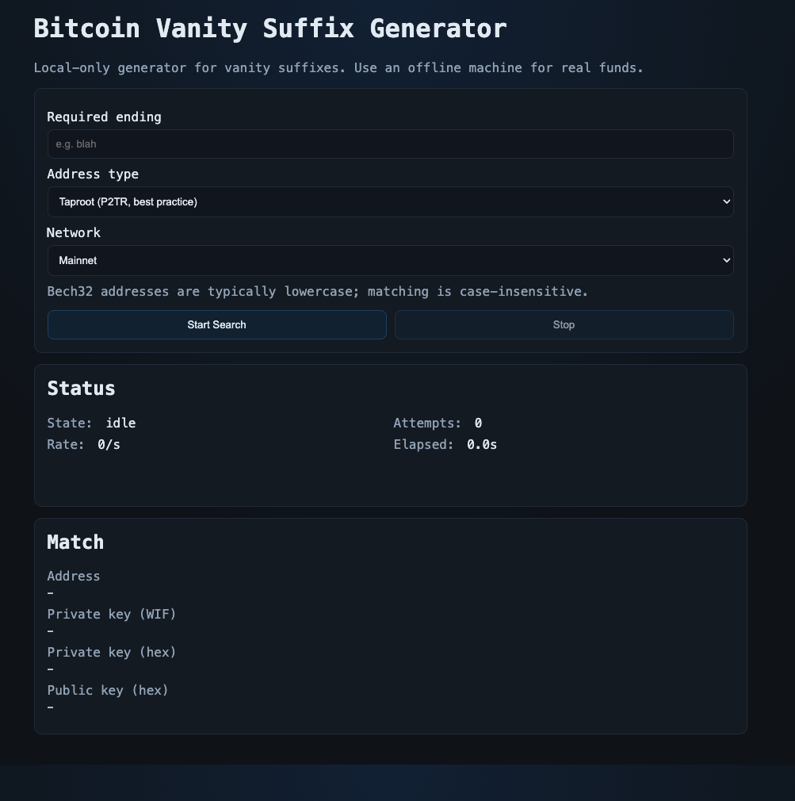
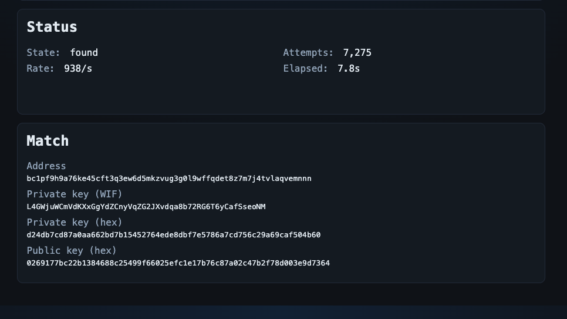

# Bitcoin Vanity Suffix Generator

Local web app that generates Bitcoin key/address pairs until the address ends with your requested suffix.



## Security model (important)

- Keys are generated with cryptographically secure randomness (`crypto.randomBytes`).
- Nothing is sent to external services.
- Run this on an offline machine before using with real funds.
- Store private keys securely. Anyone with the private key controls the funds.
- Do not use this as a brain wallet or with predictable entropy.

## Address standards

- Default is `P2TR` (Taproot, `bc1p...`) which is best-practice for new single-key receives.
- Also supports `P2WPKH` (`bc1q...`) and `P2PKH` legacy (`1...` Base58).
- Bech32 (`P2TR`, `P2WPKH`) has a restricted character set and is usually lowercase.
- Base58 (`P2PKH`) supports mixed case; suffix matching in this app is always case-insensitive.

## Run

```bash
npm install
npm start
```

Open:

`http://127.0.0.1:3000`



## How to use

1. Enter required suffix (ending text).
2. Pick address type and network.
3. Click `Start Search` and wait for a match.
4. Save the matching private key securely.

## Notes

- Longer suffixes are exponentially slower.
- Mainnet matches are valid for real BTC.
- Testnet is for testing only.
